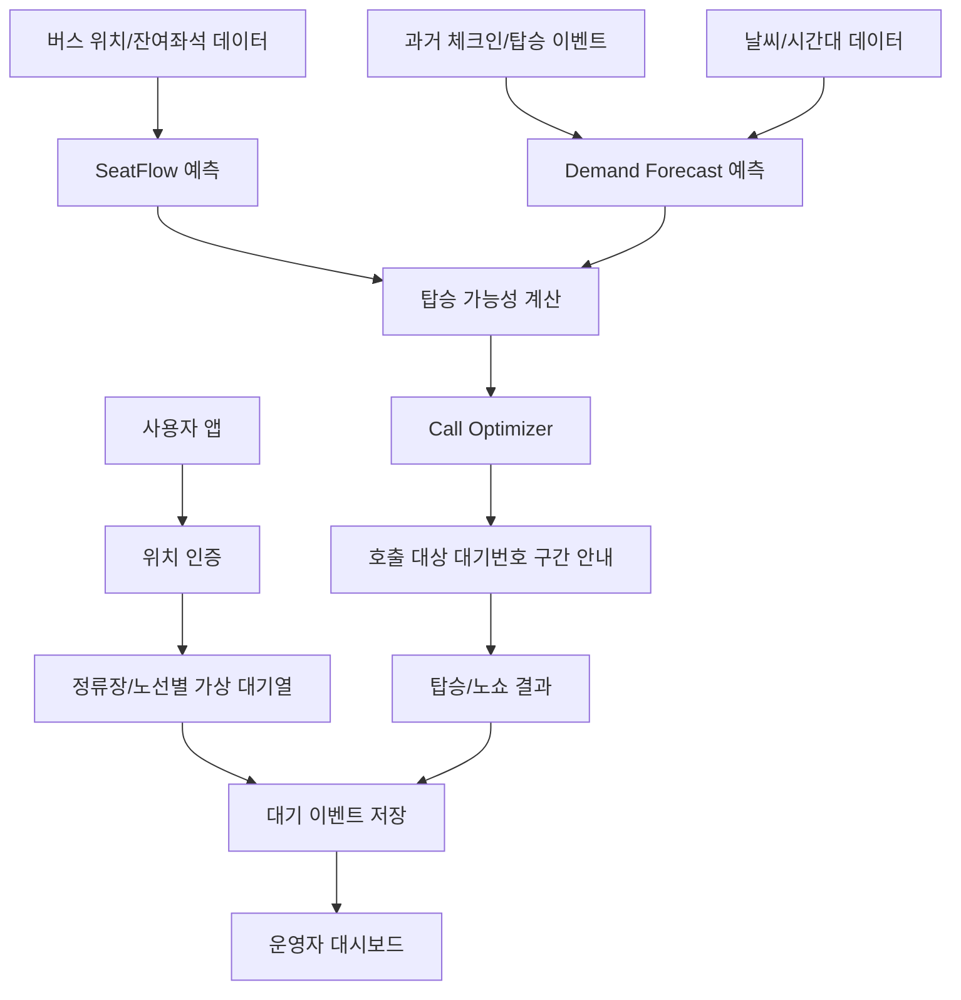

# QueueBus 서비스 플로우

## 1. 사용자 시나리오

### 상황

퇴근 시간, 사용자는 광역버스 정류장에 도착했습니다. 평소에는 정류장 앞에 긴 줄이 있어 이번 버스를 탈 수 있을지 알기 어렵고, 더운 날씨에 줄을 오래 서야 했습니다.

### 사용자 흐름

1. 앱을 열면 `주변 광역버스 정류장` 화면에서 내 위치 기준 가까운 정류장이 표시됩니다.
2. 사용자는 정류장을 선택합니다.
3. 정류장 화면에서 탈 노선을 선택합니다.
4. 앱은 사용자 좌표와 정류장 좌표의 거리를 계산합니다.
5. 100m 이내이면 `위치 인증 완료` 상태가 되고 체크인이 가능합니다.
6. 사용자가 체크인하면 노선별 가상 대기열에 등록되고 고정 대기번호가 발급됩니다.
7. 앱은 내 앞 대기 인원, 다음 차량 탑승 가능성, 다음다음 차량 탑승 가능성, 예상 대기 시간을 안내합니다.
8. 호출 전까지 사용자는 정류장 바로 앞에 줄 서지 않고 주변 그늘, 쉼터, 지하철 출구 등에서 대기할 수 있습니다.
9. AI가 이번 차량에 탑승 가능성이 높은 인원을 계산하면 사용자에게 탑승 호출 알림을 보냅니다.
10. 사용자는 앱에서 탑승 호출과 내 앞 대기 인원을 확인하고, 기존 바닥 버스번호가 표시된 해당 노선 대기 위치로 이동합니다.
11. 버스 도착 후 앞사람 수를 기준으로 짧게 정렬해 탑승합니다.
12. 호출 후 미도착자는 일정 시간 후 자동 스킵되거나 다음 차량으로 이월됩니다.

### 사용자 안내 문구 예시

```text
현재 대기번호: 23번
내 앞 대기 인원: 22명
다음 차량 탑승 가능성: 38%
다음다음 차량 탑승 가능성: 91%
예상 대기 시간: 약 14분
호출 전까지 정류장 앞에 줄 서지 않아도 됩니다.
```

호출 시:

```text
탑승 호출되었습니다.
4137번 기존 대기 위치로 이동해 주세요.
현재 내 앞 대기 인원: 6명
버스 도착 예상: 2분 후
```

## 2. 운영자 시나리오

### 상황

지자체 또는 운수사 담당자는 특정 광역버스 정류장의 퇴근 시간 혼잡이 반복된다는 민원을 받고 있습니다. 기존에는 현장 민원과 체감에 의존했지만, QueueBus를 통해 정류장별·노선별 대기 수요와 호출 결과를 볼 수 있습니다.

### 운영자 흐름

1. 운영자는 대시보드에서 정류장별 현재 대기 인원을 확인합니다.
2. 노선별 대기열 길이와 다음 차량 예상 탑승 가능 인원을 확인합니다.
3. 혼잡도와 폭염/한파 위험 등급을 확인합니다.
4. AI가 제안한 호출 인원과 호출 시점을 확인합니다.
5. 시간대별 대기 수요 차트로 피크 구간을 파악합니다.
6. 호출 성공률, 노쇼율, 평균 대기시간, 반복 만차 구간을 확인합니다.
7. PoC 종료 후 해당 데이터를 기반으로 배차 개선, 현장 안내 인력 배치, 정류장 시설 개선 필요성을 검토합니다.

## 3. 전체 데이터 플로우



## 4. 기존 노선 대기 위치와 대기번호 UX

광역버스 정류장은 보통 바닥에 버스번호가 표시되어 있어 노선별 대기 위치가 이미 정해져 있습니다. QueueBus는 이 물리적 위치를 새로 만들지 않고, 전체 대기자는 앱 안의 가상 대기열로 관리하며 이번 차량 탑승 가능성이 높은 대기번호 구간만 기존 노선 대기 위치로 호출합니다.

대기번호 방식:

- 체크인 시 발급된 대기번호는 원칙적으로 고정합니다.
- 앞사람 취소, 탑승, 노쇼가 발생해도 내 대기번호를 계속 바꾸지 않고 `내 앞 대기 인원`만 갱신합니다.
- 이번 차량에 탑승 가능성이 높은 일부 인원만 호출합니다.
- 사용자는 기존 바닥 버스번호가 표시된 해당 노선 대기 위치로 이동합니다.
- 현장에서는 앱에 표시된 내 앞 대기 인원을 기준으로 짧게 정렬합니다.
- 서로 순번을 묻지 않아도 됩니다.
- 미도착자는 일정 시간 후 자동 스킵 또는 다음 차량으로 이월됩니다.

## 5. 데이터 이벤트

| 이벤트 | 설명 | 주요 필드 |
| --- | --- | --- |
| check_in | 위치 인증 후 대기열 등록 | user_alias, station_id, route_id, queue_position |
| location_exit | 정류장 반경 이탈 | distance_meters, duration_seconds |
| call_sent | 탑승 호출 발송 | called_queue_start, called_queue_end, eta_minutes |
| call_ack | 사용자 호출 확인 | response_seconds |
| no_show | 호출 후 미도착 | queue_position, elapsed_seconds |
| boarded | 탑승 성공 | vehicle_id, wait_minutes |
| carried_over | 다음 차량 이월 | reason |

## 6. 개인정보 처리 플로우

1. 체크인 시 정류장 반경 내 여부만 판단합니다.
2. 운영자 화면에는 개인 위치 좌표를 표시하지 않습니다.
3. 탑승 완료 후 개인 식별 가능한 위치정보는 최소 보관합니다.
4. 분석용 데이터는 정류장, 노선, 시간대 단위로 집계합니다.
5. 이상탐지는 서비스 공정성 유지를 위한 재인증과 안내 중심으로 운영합니다.
