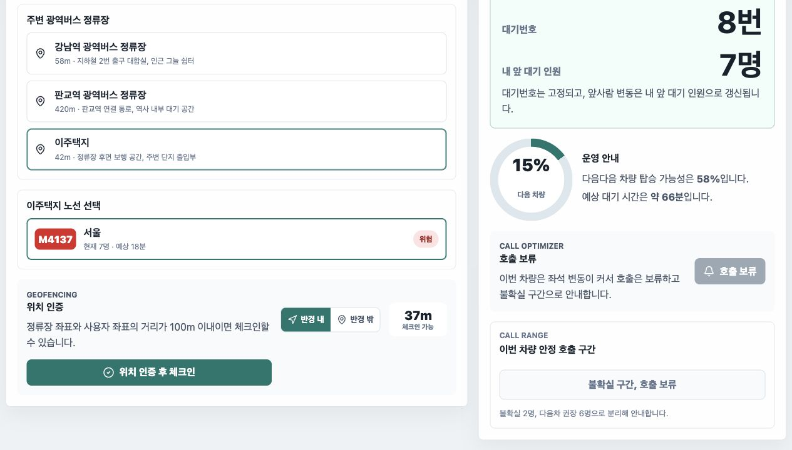
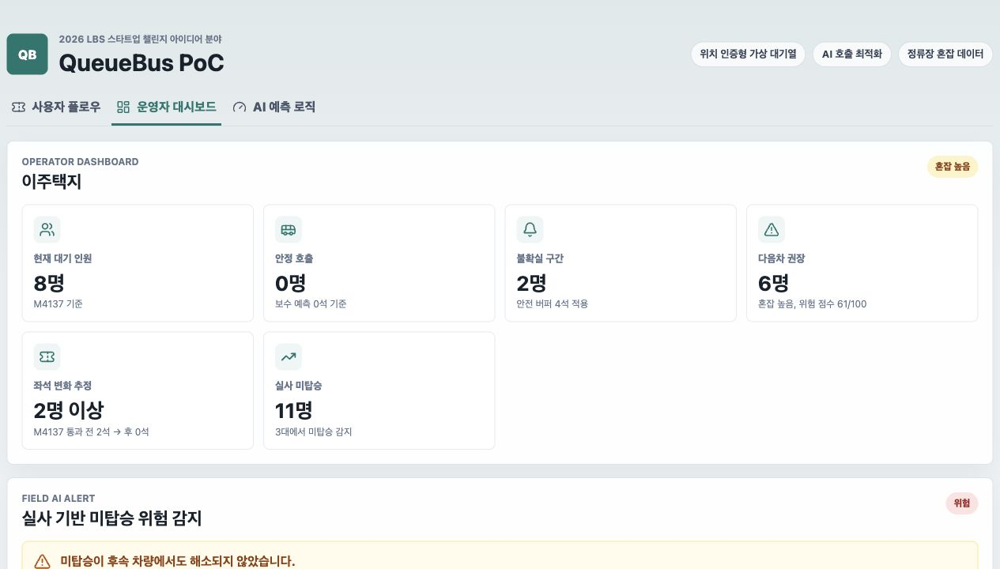

# 2026 LBS 스타트업 챌린지 최종 제출용 사업계획서

지원분야: 아이디어 분야  
팀명: QueueBus 팀  
서비스명: QueueBus  
정식 제목: QueueBus: AI 기반 위치인증형 광역버스 정류장 혼잡 예측 및 탑승 호출 서비스  
작성일: 2026-06-02  

## 제출 전 확인

공식 공고 기준 아이디어 분야는 공고 시작일 기준 청년(34세 이하) 개인 또는 팀이 지원할 수 있으며, 팀의 경우 청년 1인 이상이 포함되어야 합니다. 접수기한은 2026년 6월 10일 16:00까지이고, 제출처는 `LBS@kmac.co.kr`입니다. 제출 파일명은 `지원분야_기업명(팀명)_제출서류명` 형식입니다.

제출 파일:

| 파일 | 제출 형식 | 상태 |
| --- | --- | --- |
| 아이디어_QueueBus팀_참가신청서 | 대표자 서명/날인 PDF | 공식 양식에 사용자 직접 입력 필요 |
| 아이디어_QueueBus팀_사업계획서 | PDF, Word, HWP 등 | 본 문서 내용을 HWP/PDF 양식에 이관 |
| 아이디어_QueueBus팀_동의서 | 대표자 서명/날인 PDF | 공식 양식에 사용자 직접 입력 필요 |
| 아이디어_QueueBus팀_신분증사본 | PDF | 청년 1인 이상 신분증 사본, 개인정보 마스킹 필요 |

본 사업계획서는 공식 1차 평가항목인 창의성 및 혁신성, 시장성 및 수요, 기술 실현 가능성, 사업화 가능성, 사회적 가치에 맞춰 작성했습니다.

## 핵심 검증 상태 요약

QueueBus는 제출 단계에서 `검증된 사실`, `현재 가정`, `PoC에서 검증할 항목`을 분리해 제시합니다. 이는 공모전 제출서에서 아이디어의 가능성을 강조하되, 아직 상용 서비스로 검증되지 않은 부분을 과장하지 않기 위한 기준입니다.

| 구분 | 현재 확인된 내용 | 제출서 표현 기준 | PoC에서 추가 검증할 항목 |
| --- | --- | --- | --- |
| 문제 검증 | 2026-06-02 이주택지 현장 실사에서 08:46 이후 미탑승과 대기 해소 지연 확인 | 실제 미탑승 사례가 확인된 PoC 후보 문제 | 다른 시간대·정류장에서도 반복되는지 확인 |
| 공공데이터 근거 | M4137 GBIS 잔여좌석·도착·위치 스냅샷과 탑승 추정 데이터 수집 | 승차 가능성 변동을 보여주는 예비 근거 | 공식 API 상시 연동, 장애 fallback |
| AI 가능성 | SeatFlow 모델 비교에서 LightGBM이 규칙 baseline 대비 MAE 개선 | 상용 정확도가 아니라 초기 모델 MVP 가능성 | 3~4주 이상 추가 데이터로 재학습·재평가 |
| 사용자 UX | React 프로토타입에서 위치 인증, 대기번호, 호출 보류, 다음차 안내 시연 가능 | 발표용 PoC 화면으로 제시 | 실제 사용자 호출 응답률, 노쇼율 측정 |
| 사업화 | 지자체 PoC, 정류장 단위 SaaS, 운수사 리포트 모델 가정 수립 | 초기 제안 단가와 검증할 수익모델로 표현 | 구매자 인터뷰, 지자체/운수사 협력 의사 확인 |

## 1. 사업 아이템 개요

QueueBus는 광역버스 정류장의 물리적 줄서기를 위치정보 기반 가상 대기열로 전환하고, AI가 다음 버스 승차 가능성과 호출 타이밍을 예측해 이용자가 줄 대신 대기번호로 편하게 기다릴 수 있게 하는 LBS 기반 대중교통 대기 관리 서비스입니다.

QueueBus는 좌석예약 서비스가 아닙니다. 특정 차량의 좌석을 사전에 확보하는 방식이 아니라, 정류장에 실제 도착한 승객만 위치 인증 후 노선별 대기열에 등록하고, 고정 대기번호와 `내 앞 대기 인원`을 안내합니다. AI는 이번 차량에 몇 명이 탈 수 있는지, 어느 대기번호 구간을 언제 기존 노선 대기 위치로 호출해야 하는지, 다음 차량 안내가 필요한지를 예측합니다.

핵심 고객은 출퇴근 광역버스 이용자와 지자체·운수사·교통 운영기관입니다. 이용자는 장시간 줄서기와 탑승 불확실성을 줄이고, 운영기관은 정류장별·노선별·시간대별 실제 대기 수요와 미탑승 신호를 확보할 수 있습니다.

## 2. 문제 인식

수도권 광역버스 정류장은 출퇴근 시간대에 긴 물리적 대기줄이 반복됩니다. 이용자는 이번 차를 탈 수 있는지 알기 어려워 줄을 계속 유지해야 하고, 폭염·한파·우천 상황에서는 야외 대기 자체가 안전 부담이 됩니다. 긴 줄은 보행로를 점유하고, 새치기나 순번 확인 과정에서 이용자 간 갈등을 만들기도 합니다.

운영기관에도 문제가 남습니다. 버스 도착 정보와 잔여좌석 정보는 제공되지만, 정류장별 실제 대기 인원, 탑승하지 못한 인원, 줄 길이, 분산 대기 가능성, 승차 포기 행동은 정량적으로 축적되기 어렵습니다. 그 결과 배차 조정, 예비차 투입, 현장 안내 인력 배치, 폭염·한파 안전 대응이 민원과 체감에 의존하게 됩니다.

QueueBus가 해결하려는 문제는 단순히 “버스가 언제 오는가”가 아니라 “내가 이번 차를 탈 수 있는가”, “계속 줄을 서 있어야 하는가”, “운영기관이 실제 수요를 알고 있는가”입니다.

## 3. 현장 실사 근거

제출 전 현장 실사를 통해 GBIS 잔여좌석 데이터만으로는 확인하기 어려운 실제 대기, 탑승, 미탑승 상황을 확인했습니다.

| 항목 | 내용 |
| --- | --- |
| 실사 일자 | 2026-06-02 |
| 정류장 | 55305 이주택지 |
| 방향 | 서울방향 |
| 관측 방식 | 현장 직접 관찰 |
| 목적 | 출근 시간대 차량별 대기 인원, 탑승 인원, 미탑승 발생 여부 확인 |

차량별 관측 결과:

| 시각 | 차량번호 | 대기 인원 | 하차 | 탑승 | 미탑승/잔여 대기 | 비고 |
| --- | ---: | ---: | ---: | ---: | ---: | --- |
| 08:33 이전 | 3293 | 6명 | 미확인 | 6명 | 0명 | 전원 탑승 |
| 08:33 | 6369 | 8명 | 미확인 | 8명 | 0명 | 전원 탑승 |
| 08:46 | 1040 | 7명 | 1명 | 3명 | 4명 | 도착 시 빈자리 2석, 하차 후 3명 탑승 |
| 09:02 전후 | 1043 | 5명 | 1명 | 1명 | 4명 | 남은 인원이 적극적으로 줄을 서지 않는 모습 관측 |
| 09:27 전후 | 4811 | 3명 | 0명 | 0명 | 3명 | 탑승 해소 없음 |

관측 결론:

1. 08:33 차량까지는 대기 승객이 모두 탑승했습니다.
2. 08:46 차량 1040번부터 미탑승이 발생했습니다. 이 차량은 이주택지 도착 전 신안2차/반도4차에서 빈자리 2석으로 확인되었고, 이주택지 도착 시에도 빈자리 2석이었습니다. 현장에서 1명이 하차하면서 3명이 탑승했지만, 대기 7명 중 4명은 탑승하지 못했습니다.
3. 이후 차량 1043번은 하차 1명, 탑승 1명에 그쳐 남은 대기 4명이 해소되지 않았습니다.
4. 마지막으로 확인한 4811번은 대기 3명, 하차 0명, 탑승 0명으로 관측되어, 08:46 이후 발생한 수요가 후속 차량에서도 충분히 해소되지 않았습니다.
5. 1043번 관측 시 남은 사람들이 적극적으로 줄을 서지 않는 모습이 확인되어, 단순 대기 인원뿐 아니라 “승차 가능성이 낮다고 판단한 이용자의 포기·체념성 대기”도 서비스 설계에서 고려해야 합니다.

이 실사 결과는 QueueBus의 필요성을 직접 뒷받침합니다. 잔여좌석 정보만으로는 실제 대기 인원과 미탑승 인원이 보이지 않습니다. QueueBus는 위치 인증 대기열과 탑승 결과 데이터를 결합해, 이용자에게는 다음 차량 승차 가능성을 안내하고 운영기관에는 실제 미탑승 수요 신호를 제공합니다.

## 4. 공식 GBIS 데이터 기반 예비 검증

현장 관찰 전후로 M4137 노선의 경기도 GBIS 공식 API 데이터를 수집해 차량별 잔여좌석, 정류장 순번, 도착 예측 정보를 분석했습니다. 2026-05-28 13:47부터 2026-05-30 20:30까지 수집한 예비 데이터는 다음과 같습니다.

| 구분 | 값 |
| --- | --- |
| 원본 스냅샷 행 | 30,930 |
| 위치 스냅샷 행 | 25,077 |
| 도착 스냅샷 행 | 5,849 |
| 탑승 추정 행 | 909 |
| 대상 노선 | M4137 |
| 대상 정류장 | 14곳 |

퇴근 방향인 서울→동탄 6개 대상 정류장은 3일 관측과 정류장별 30개 이상 샘플 기준을 충족했습니다. 서울 도심 후반 정류장으로 갈수록 승차 가능성이 크게 떨어지는 패턴이 확인되었습니다.

| 정류장 | 샘플 | 관측일 | p20 잔여좌석 | 중앙값 | 0석 신호 | 10석 이하 신호 | 제출 해석 |
| --- | ---: | ---: | ---: | ---: | ---: | ---: | --- |
| 서울역버스환승센터 | 377 | 3 | 15석 | 28석 | 8.2% | 14.9% | 호출 인원 조정 필요 |
| 명동입구 | 452 | 3 | 0석 | 12석 | 32.1% | 45.6% | 다음차 안내 필요 |
| 명동성당 | 151 | 3 | 0석 | 3석 | 44.4% | 60.3% | 다음차 안내 필요 |

GBIS 데이터는 정류장·시간대별 승차 가능성 신호를 제공하지만, 실제 줄 선 사람 수와 미탑승 인원은 직접 보여주지 않습니다. 따라서 QueueBus는 공식 API 데이터와 현장 위치 인증 대기열 데이터를 결합해 “예상 잔여좌석”과 “실제 승차 수요” 사이의 차이를 줄이는 방향으로 고도화합니다.

## 5. 해결 방안

QueueBus의 사용자 흐름은 다음과 같습니다.

1. 사용자가 광역버스 정류장 근처에 도착합니다.
2. 앱이 사용자 GPS와 정류장 좌표를 비교해 정류장 반경 내 위치 인증을 수행합니다.
3. 사용자는 탈 노선을 선택하고 노선별 가상 대기열에 등록합니다.
4. 대기번호는 위치 인증 완료 시점 기준 선착순으로 고정 부여합니다.
5. 앱은 앞사람의 탑승, 취소, 노쇼를 반영해 `내 앞 대기 인원`을 갱신합니다.
6. AI는 차량 잔여좌석, 목표 정류장까지의 승하차 패턴, 현재 대기열, 시간대별 수요를 결합해 이번 버스와 다음 버스 승차 가능성을 계산합니다.
7. 버스 도착 전, 탑승 가능성이 높은 대기번호 구간만 기존 노선 대기 위치로 호출합니다.
8. 호출되지 않은 이용자는 주변 그늘, 쉼터, 실내 공간 등에서 계속 대기할 수 있습니다.
9. 탑승 결과와 미탑승 데이터를 운영자 대시보드에 집계해 배차·현장 운영 판단 근거로 제공합니다.

AI는 순번을 정하지 않습니다. 순번은 위치 인증 기반 선착순으로 보장하고, AI는 예측과 운영 최적화에만 사용합니다. 이 구조는 공정성 논란을 줄이고, 심사위원과 운영기관이 이해하기 쉬운 설명 가능한 서비스 구조를 만듭니다.

## 6. LBS 활용 계획

QueueBus에서 위치정보는 서비스의 부가 기능이 아니라 체크인 조건입니다.

| 위치정보 요소 | 활용 목적 |
| --- | --- |
| 사용자 현재 위치 | 실제 정류장 도착 여부 확인 |
| 정류장 좌표 | 100m 반경 지오펜스 기준 |
| 위치 이탈 여부 | 대기열 유지, 재인증, 노쇼 판단 |
| 버스 실시간 위치 | 호출 시점 계산 |
| 차량 정류장 순번 | 목표 정류장 도착 시 예상 잔여좌석 계산 |
| 주변 공간 정보 | 호출 전 분산 대기 장소 안내 |

운영 초기에는 Haversine 거리 계산으로 사용자와 정류장 간 거리를 산정하고, 100m 이내일 때 체크인을 허용합니다. 서비스 적용 단계에서는 PostGIS 기반 지오펜스, GPS 정확도 보정, 위치 이탈 감지, 정류장 주변 대기 가능 공간 안내를 함께 적용합니다.

## 7. AI 활용 계획

QueueBus의 AI는 다음 기능을 담당합니다.

| AI 기능 | 설명 | 운영 초기 구현 |
| --- | --- | --- |
| Demand Forecast AI | 정류장·노선·시간대별 대기 수요 예측 | 이동평균, 요일·시간대 규칙 |
| SeatFlow AI | 차량별 목표 정류장 도착 시 예상 잔여좌석 예측 | 전역 LightGBM + 세그먼트 보정 |
| Boarding Probability AI | 대기번호별 이번 차량 탑승 가능성 계산 | 안정 호출/불확실/다음차 권장 분리 |
| Call Optimizer AI | 호출 인원, 호출 타이밍, 호출 대상 대기번호 구간 산정 | 보수 호출 정책 |
| Congestion & Risk AI | 반복 만차, 보행로 점유, 폭염·한파 위험 알림 | 혼잡 점수 규칙 |
| Anomaly Detection | 위치조작, 반복 노쇼, 중복 체크인 의심 탐지 | 규칙 기반 탐지 |

운영 초기부터 모든 기능을 단순 규칙으로만 두지 않습니다. 현재 GBIS 잔여좌석·차량 위치 데이터가 이미 수집되고 있으므로, 핵심 기능인 SeatFlow AI는 LightGBM 기반 예측 모델로 시작합니다. 다만 예측 잔여좌석을 그대로 호출 인원으로 사용하지 않고, 시간대·출근 피크·잔여좌석 위험구간별 보정값을 적용해 안정 호출 인원, 불확실 인원, 다음차 권장 인원을 분리합니다. 사용자 체크인, 호출 응답, 탑승 성공, 미탑승 결과가 쌓이면 Boarding Probability, Call Optimizer, Left-behind Risk도 분류 모델과 정책 최적화 모델로 전환합니다.

세부적으로는 SeatFlow AI, Demand Forecast AI, Boarding Probability AI, Call Optimizer AI, Left-behind Risk AI, Congestion & Safety AI, Anomaly Detection AI, Operator Insight AI를 단계적으로 적용합니다. 이들은 각각 별도 SaaS 서비스가 아니라 QueueBus라는 하나의 정류장 대기 관리 SaaS 안에서 동작하는 내부 예측 모듈입니다. 각 모듈은 입력 데이터와 출력 결과가 명확하며, 운영 초기에는 실시간 GBIS 수집 데이터를 이용한 SeatFlow 학습 모델과 보수 호출 정책을 중심으로 적용하고, 위치 인증 대기열 이벤트가 누적되면 나머지 모듈도 회귀 모델, 분류 모델, 시계열 모델, 이상탐지 모델로 확장합니다. 상세 설계는 [21-ai-model-catalog.md](/Users/yun-iljun/programming/queue-bus/docs/21-ai-model-catalog.md)와 [25-service-operations-architecture.md](/Users/yun-iljun/programming/queue-bus/docs/25-service-operations-architecture.md)에 정리했습니다.

모델 학습 시에는 무작위 분할만 사용하지 않고, 날짜 기준 holdout, 날짜별 교차검증, 차량 그룹 분리, 정류장별 샘플 하한, 규칙 baseline 비교를 적용합니다. 이를 통해 같은 차량의 연속 스냅샷을 모델이 외우는 데이터 누수를 막고, 실제 미래 날짜에도 성능이 유지되는지 확인합니다. 학습·검증·과적합 방지 계획은 [22-ai-training-validation-plan.md](/Users/yun-iljun/programming/queue-bus/docs/22-ai-training-validation-plan.md)에 정리했습니다.

예측 로직 예시:

```text
expectedRemainingSeats =
  currentRemainingSeats
  - averageBoardingPerStop * remainingStopsToTarget
  + averageAlightingPerStop * remainingStopsToTarget

callCount =
  min(maxCallCount, ceil(expectedRemainingSeats / (1 - noShowRate)))

congestionScore =
  waitingCount * 0.5
  + expectedWaitMinutes * 0.3
  + weatherRiskScore * 0.2
```

오늘 실사에서 확인한 1040번 사례처럼, 도착 시 빈자리 2석이어도 하차 1명이 발생하면 실제 탑승 가능 인원은 3명이 됩니다. 따라서 QueueBus는 잔여좌석뿐 아니라 하차 가능성, 과거 정류장별 하차 패턴, 현장 탑승 결과를 함께 학습해야 합니다.

## 8. 창의성 및 차별성

| 구분 | 기존 좌석예약 서비스 | 버스 도착 알림 서비스 | QueueBus |
| --- | --- | --- | --- |
| 핵심 목적 | 특정 차량 좌석 확보 | 도착 시간 안내 | 편한 대기와 승차 가능성 안내 |
| 위치정보 역할 | 보조적 | 선택적 | 체크인의 필수 조건 |
| 순번 기준 | 예약 규칙 또는 예약 시점 | 없음 | 위치 인증 완료 시점 |
| AI 역할 | 제한적 | 제한적 | 수요·잔여좌석·호출 타이밍 예측 |
| 현장 UX | 예약 확인 | 자율 대기 | 대기번호로 기다리고 호출 시 이동 |
| 운영 데이터 | 예약 수요 중심 | 조회·알림 중심 | 대기·탑승·미탑승·노쇼 데이터 |

QueueBus의 차별성은 세 가지입니다.

1. 정류장에 실제 도착한 사람만 대기열에 들어갈 수 있습니다.
2. 대기 순번은 AI가 아니라 위치 인증 기반 선착순으로 보장합니다.
3. 이용자 편의와 운영기관 데이터 수요를 동시에 해결합니다.

## 9. 시장성 및 고객 수요

1차 사용자는 출퇴근 광역버스 이용자입니다. 특히 장시간 줄서기 부담이 큰 직장인, 고령자, 임산부, 교통약자, 초행길 이용자, 폭염·한파 취약 이용자에게 필요성이 큽니다.

2차 고객은 지자체, 운수사, 교통 운영기관, 정류장 관리기관입니다. 이들은 혼잡 정류장 관리, 민원 대응, 배차 개선, 현장 질서 유지, 폭염·한파 안전 대응을 위해 실제 대기 수요 데이터가 필요합니다.

시장 진입은 전국 단위가 아니라 혼잡 정류장 1곳과 노선 1~2개에서 시작합니다. PoC에서 대기시간 감소, 호출 응답률, 미탑승 감소, 예측 정확도, 보행로 점유 완화 지표를 확보한 뒤 같은 지자체 내 주요 광역버스 정류장으로 확장합니다.

초기 적용 후보는 “대기줄이 길다”는 체감만이 아니라, 잔여좌석 감소, 0석 신호, 현장 미탑승 관찰, 보행로 점유 가능성이 함께 확인되는 정류장으로 좁힙니다.

| 우선순위 | 후보 정류장/유형 | 선정 근거 | 초기 검증 방식 |
| --- | --- | --- | --- |
| 1 | 55305 이주택지, M4137 서울방향 | 현장 실사에서 미탑승과 후속 차량 대기 해소 지연 확인 | 출근 시간대 2~3주 관찰, 호출 응답률·미탑승 감지율 측정 |
| 2 | 명동입구·명동성당 등 서울 도심 후반 정류장 | GBIS 예비 데이터에서 p20 잔여좌석 0석, 0석 신호 반복 | 퇴근 시간대 잔여좌석·대기열 동시 수집 |
| 3 | 서울역버스환승센터 등 대형 환승 정류장 | 승차 가능성은 남아 있으나 시간대별 호출 인원 조정 필요 | 호출 인원 보수 정책, 분산 대기 안내 효과 측정 |
| 4 | 강남역·판교역 등 광역버스 대기열 밀집 정류장 | 장시간 줄서기, 보행로 점유, 날씨 노출 문제가 반복되는 유형 | 지자체/운수사 협의 후 노선 1~2개 제한 PoC |
| 5 | 민원 다발·폭염 취약 정류장 | 안전 대응과 현장 안내 인력 배치 수요가 높은 유형 | 운영자 대시보드 리포트와 현장 안내 키트 검증 |

## 10. 사업화 모델

B2C 직접 과금보다 B2G/B2B SaaS 모델이 적합합니다. 개인 이용자는 무료 또는 지자체 서비스로 제공하고, 운영기관이 정류장 단위 SaaS 이용료와 수요 리포트 비용을 부담합니다.

수익 모델:

| 모델 | 설명 |
| --- | --- |
| 지자체 PoC 구축비 | 혼잡 정류장 대상 초기 실증 구축 |
| 정류장 단위 SaaS | 대기열·혼잡 대시보드 월 이용료 |
| 운수사 데이터 구독 | 노선별 대기 수요, 만차 반복, 배차 개선 리포트 |
| 운영 알림 API | 피크 수요, 미탑승 반복, 예비차 검토 알림 |
| 현장 키트 설치비 | QR 안내판, 바닥 노선번호 연계 안내, 전광판 연동 |
| API 연동·유지보수 | 지자체·운수사 시스템 연동 |

초기 제안 단가와 확장 가정은 다음과 같이 잡습니다. 아래 금액은 공모전 단계의 사업성 검토용 가정이며, 실제 계약 전에는 정류장 수, API 연동 범위, 현장 안내물 설치 여부에 따라 조정합니다.

| 단계 | 대상 범위 | 과금 구조 가정 | 검증할 지표 |
| --- | --- | --- | --- |
| 1차 PoC | 혼잡 정류장 1곳, 노선 1~2개, 2~3개월 | 구축·운영비 1,500만~3,000만원 | 미탑승 감지율, 호출 응답률, 물리적 줄서기 시간 감소 |
| 시범 운영 | 같은 지자체 내 3~5개 정류장 | 정류장당 월 30만~80만원 SaaS + 현장 키트 100만~300만원 | 정류장별 반복 혼잡 알림 정확도, 운영자 리포트 활용도 |
| 운수사 리포트 | 혼잡 노선 단위 월간 수요 분석 | 기관당 월 100만~300만원 데이터 리포트 | 만차 반복 구간, 시간대별 수요 절단, 배차 조정 후보 도출 |
| 확장 운영 | 10개 이상 정류장, 여러 노선 | 연 단위 구독·유지보수 계약 | 민원 감소, 운영 인력 배치 효율, 추가 정류장 전환율 |

시장 진입은 `유료 PoC → 제한 시범 운영 → 정류장 단위 SaaS` 순서가 적합합니다. 초기에는 이용자에게 직접 과금하지 않고, 민원·안전·혼잡 관리를 책임지는 지자체와 운수사가 비용을 부담하는 구조로 설계합니다.

## 11. 기술 실현 가능성

QueueBus는 Vite, React, TypeScript 기반 웹 화면과 미니PC GBIS 수집 파이프라인, SeatFlow 학습·검증 스크립트로 구성되어 있습니다. 현재 사용자 화면, AI 판단 화면, 운영자 대시보드에서 잔여좌석 예측, 안정 호출 인원, 불확실 인원, 다음차 권장 판단을 시연할 수 있습니다.

운영 초기 검증에는 2026년 6월 2일 55305 이주택지 서울방향 실사 데이터를 반영했습니다. 현재 프로토타입은 잔여좌석, 대기번호, 노쇼율, 하차 관측값을 이용해 안정 호출 인원과 다음차 권장 인원을 계산하고, 실사 데이터에서 미탑승 반복 여부를 감지해 운영자 대시보드에 위험 알림을 표시합니다. 또한 GBIS 스냅샷과 좌석 변화 기반 탑승 추정치 1,937건으로 SeatFlow AI 학습 데이터셋을 생성하고, Random Forest, LightGBM, XGBoost 회귀 모델을 규칙 기반 baseline과 비교했습니다. 최신 날짜 holdout 검증에서 LightGBM은 MAE 2.69석으로 baseline 3.96석 대비 32.1% 개선했고, 날짜별 교차검증 평균에서도 LightGBM은 MAE 2.81석으로 baseline 4.10석 대비 31.4% 개선되어 운영 초기 기본 모델로 선정했습니다.

실서비스에서는 예측 잔여좌석을 그대로 호출 인원으로 사용하지 않습니다. 시간대, 출근 피크/비피크, 잔여좌석 위험구간별 성능을 분해하고 피크/비피크 전용 모델과 위험구간 전용 모델도 별도로 검증했습니다. 현재 데이터량에서는 세그먼트 전용 모델보다 시간대·피크·위험구간 feature를 포함한 전역 LightGBM이 더 안정적입니다. 따라서 전역 LightGBM을 기본 모델로 적용하고, 학습 residual 기반 보정값을 적용해 2석 이상 과대예측률을 20.4%에서 10.0%로 줄이는 보수 호출 정책을 사용합니다. 상세 결과는 [24-seatflow-model-comparison.md](/Users/yun-iljun/programming/queue-bus/docs/24-seatflow-model-comparison.md)에 정리했습니다.

운영 구조:

| 모듈 | 운영 초기 | 확장 단계 |
| --- | --- | --- |
| 위치 인증 | Haversine 100m 판정 | PostGIS, 위치 이탈 감지 |
| 대기열 | 노선별 선착순 번호 | 실시간 동기화, 운영자 개입 로그 |
| 버스 데이터 | GBIS 수집 데이터 | 공식 API 상시 연동, 장애 fallback |
| 예측 | 전역 LightGBM + 세그먼트 보정 | 세그먼트 모델 승격, 시계열 모델 |
| 호출 정책 | 안정 호출/불확실/다음차 권장 분리 | 정책 최적화, A/B 검증 |
| 대시보드 | React 집계 화면 | SaaS 관리자, 자동 리포트 |
| 개인정보 보호 | 최소 위치 저장, 집계 표시 | 보관주기 자동화, 비식별화 |

## 12. 개인정보 및 위치정보 보호

QueueBus는 위치정보를 정류장 체크인, 대기열 유지, 호출 안내 목적에 한정해 사용합니다.

- 개인의 정밀 이동 경로를 장기 저장하지 않습니다.
- 운영자 대시보드에는 개인 단위 위치가 아니라 정류장·노선·시간대 단위 집계 데이터만 표시합니다.
- 탑승 완료 후 개인 식별 가능한 위치정보는 최소 보관합니다.
- 통계 목적 데이터는 비식별화합니다.
- 위치정보 수집·이용 목적과 보관 기간을 앱에서 명확히 고지합니다.
- 위치정보사업 또는 위치기반서비스 신고·등록 필요 여부는 사업화 단계에서 법률 자문과 함께 검토합니다.

운영·법제 리스크와 대응:

| 리스크 | 발생 가능 상황 | 대응 방안 |
| --- | --- | --- |
| GPS 오차 | 고층 건물, 지하 출구, 중앙차로 주변에서 위치가 흔들림 | 100m 지오펜스와 GPS 정확도 값을 함께 확인하고, 정확도 낮음 상태에서는 체크인을 보류하거나 재인증 요청 |
| 위치조작·대리 체크인 | 정류장 밖에서 가짜 위치로 대기열 등록 시도 | 위치 정확도, 체크인 후 이탈, 반복 이상 패턴을 탐지하고 운영자 검토 로그 생성 |
| 노쇼 | 호출받은 이용자가 기존 대기 위치로 오지 않음 | 호출 확인 제한시간, 도착 구역 재인증, 반복 노쇼 사용자 보수 호출 반영 |
| 앱 미사용자 | 스마트폰 미사용자 또는 앱 접근이 어려운 이용자 존재 | PoC 단계에서는 QR 안내와 현장 안내 인력 보조를 병행하고, 상용 단계에서는 전광판·키오스크 연동 검토 |
| 호출 직전 재혼잡 | 호출 대상자가 한 번에 몰려 기존 줄이 다시 생김 | 안정 호출 인원을 보수적으로 제한하고, 불확실 인원과 다음차 권장 인원을 분리 안내 |
| 개인정보 과수집 | 정밀 위치나 이동 경로가 장기 저장될 위험 | 체크인 판정 후 원본 위치 장기 보관 금지, 집계·비식별 데이터 중심 대시보드 구성 |
| 법제 불확실성 | 위치기반서비스 신고·등록 또는 위탁 운영 범위 판단 필요 | PoC는 최소 수집·동의 기반으로 운영하고, 사업화 전 법률 자문과 신고·등록 절차 검토 |

## 13. PoC 계획 및 성과지표

초기 PoC는 `55305 이주택지 서울방향`처럼 실제 미탑승과 대기 해소 지연이 확인된 정류장 또는 퇴근 시간대 서울 도심 혼잡 정류장 1곳에서 시작합니다. 노선은 M4137 등 혼잡 신호가 반복되는 광역버스 1~2개로 제한합니다.

추진 단계:

| 단계 | 기간 | 목표 | 산출물 |
| --- | --- | --- | --- |
| MVP | 1개월 | 발표용 프로토타입 완성 | 사용자 화면, 운영자 대시보드, 예측 로직 |
| 현장 PoC | 2~3개월 | 정류장 1곳 실증 | 관찰 데이터, 예측 오차, 사용자 피드백 |
| 시범 운영 | 4~6개월 | 지자체·운수사 협력 | 현장 안내, 대시보드, 수요 리포트 |
| 사업화 | 1년 | 정류장 단위 SaaS | 구독형 대시보드, 운영 알림 API |

성과지표:

| 지표 | 목표 |
| --- | --- |
| 평균 물리적 줄서기 시간 | 30% 이상 감소 |
| 호출 응답률 | 80% 이상 |
| 차량별 탑승 가능 인원 예측 오차 | ±3명 이내 |
| 미탑승 발생 감지율 | 80% 이상 |
| 반복 혼잡 시간대 운영자 알림 정확도 | 70% 이상 |
| 정류장별·노선별·시간대별 리포트 | 자동 생성 |

## 14. 사회적 가치

QueueBus는 위치정보와 AI를 활용해 시민의 일상 이동 문제를 해결합니다.

| 사회문제 | 기대 효과 |
| --- | --- |
| 폭염·한파·우천 노출 | 호출 전 분산 대기로 야외 대기 시간 감소 |
| 교통약자 부담 | 고령자, 임산부, 이동 약자의 장시간 줄서기 완화 |
| 보행로 점유 | 전체 줄 대신 호출 대상만 이동해 보행 불편 완화 |
| 이용자 갈등 | 고정 대기번호와 내 앞 대기 인원으로 순번 갈등 감소 |
| 운영 데이터 부족 | 실제 대기·탑승·미탑승 수요를 운영기관에 제공 |

## 15. 팀 역량 및 보완 계획

QueueBus 팀은 위치기반 서비스 기획, 프론트엔드 프로토타입 구현, 교통 데이터 수집·분석, 현장 PoC 설계 역량을 중심으로 사업을 추진합니다. 공모전 선정 후에는 BM 컨설팅, 기술 멘토링, AI 전환 컨설팅을 활용해 위치정보 법제 검토, 공식 API 연동, 지자체·운수사 협력, 현장 실증 운영 역량을 보완합니다.

역할 분담:

| 역할 | 담당 내용 |
| --- | --- |
| 사업기획·현장 리서치 | 문제 정의, 실사, 제출서 작성, PoC 협의 |
| 프론트엔드·프로토타입 | 사용자 화면, 운영자 대시보드, 시연 구현 |
| 데이터·AI | GBIS 수집, 예측 로직, 실사 데이터 비교 |
| 운영 협력 | 지자체·운수사 협의, 현장 키트 설계 |

현재까지의 실행 근거:

| 역량 | 현재 산출물 | 심사 대응 포인트 |
| --- | --- | --- |
| 문제 정의·기획 | 최종 사업계획서, 1페이지 요약, 차별성 문서 | 아이디어 구체성, 창의성 |
| 프론트엔드 구현 | 사용자 플로우, 운영자 대시보드, AI 예측 탭 | 발표 시연 가능성, 기술 실현 가능성 |
| 데이터 수집·분석 | GBIS 수집 스크립트, 잔여좌석 분석, 현장 관찰 CSV | 시장성 근거, PoC 검증 가능성 |
| AI 모델링 | SeatFlow 학습 데이터셋, LightGBM/XGBoost/Random Forest 비교 | AI 활용, 과적합 방지 계획 |
| 운영 설계 | 이벤트 로그, 보수 호출 정책, 재학습·fallback 기준 | 실제 서비스 전환 가능성 |

공모전 이후 1개월 실행계획:

| 기간 | 실행 내용 | 완료 기준 |
| --- | --- | --- |
| 1주차 | 공식 API 연동 범위와 PoC 후보 정류장 1곳 확정 | 대상 정류장, 노선, 관찰 시간대 고정 |
| 2주차 | 사용자 체크인·호출·탑승 결과 이벤트 로그 설계 구체화 | `check_in`, `call_sent`, `boarding_failed` 등 핵심 이벤트 스키마 확정 |
| 3주차 | 현장 관찰 3회 이상 추가 수집 및 모델 재학습 | 날짜별 holdout 기준 예측 오차 재산정 |
| 4주차 | 지자체·운수사 제안용 PoC 패키지 작성 | PoC 범위, 비용, KPI, 개인정보 보호 방안 포함 제안서 완성 |

## 16. 제출 시 삽입 권장 자료

| 자료 | 파일 또는 출처 | 삽입 위치 |
| --- | --- | --- |
| 서비스 흐름도 | `docs/assets/queuebus-service-flow.png` | 1장 또는 기술성 |
| 개인정보 보호 구조도 | `docs/assets/privacy-data-flow.png` | 개인정보 보호 |
| GBIS 위험 차트 | `docs/assets/gbis-evening-station-risk.png` | 데이터 근거 |
| GBIS 히트맵 | `docs/assets/gbis-evening-heatmap.png` | 기술성·시장성 |
| 현장 실사 CSV | `data/field-observation-2026-06-02.csv` | 부록 또는 근거 표 |
| 프로토타입 캡처 | `docs/assets/prototype-passenger-checkin.jpg`, `docs/assets/prototype-operator-dashboard.jpg`, `docs/assets/prototype-ai-prediction.jpg` | 기술 구현 |

### 프로토타입 캡처 1: 사용자 체크인·대기번호 화면



캡션: 위치 인증 후 노선별 고정 대기번호를 발급하고, 잔여좌석 위험이 높을 때는 무리하게 호출하지 않고 `호출 보류`와 다음차 안내를 제공한다. 심사 항목 중 기술 실현 가능성, LBS 활용, 사용자 편의 개선을 보여주는 화면이다.

### 프로토타입 캡처 2: 운영자 대시보드



캡션: 운영자는 정류장·노선 단위로 현재 대기 인원, 안정 호출 인원, 불확실 구간, 다음차 권장 인원, 실사 미탑승 위험을 확인한다. 심사 항목 중 PoC 계획, 시장성 및 운영기관 수요, 사회적 가치를 보여주는 화면이다.

### 프로토타입 캡처 3: AI 예측 로직


캡션: SeatFlow AI는 잔여좌석 예측값을 그대로 호출 인원으로 쓰지 않고 안전 버퍼와 보수 보정을 적용해 안정 호출·불확실·다음차 권장을 분리한다. 심사 항목 중 AI 활용, 기술 실현 가능성, 과적합 방지형 PoC 설계를 보여주는 화면이다.

현장 사진을 제출본에 넣을 경우 얼굴, 차량번호, 개인 식별 가능 정보는 반드시 마스킹합니다. 차량번호는 분석용 원본 기록에는 남기되, 공개 제출본에서는 필요시 일부 가림 처리합니다.

## 17. 최종 강조 문장

QueueBus는 광역버스 좌석을 예약하는 서비스가 아니라, 정류장에 실제 도착한 승객의 대기 순서를 위치정보로 인증하고, AI가 차량별 승차 가능성과 호출 시점을 예측해 물리적 줄서기 부담을 줄이는 정류장 대기 관리 서비스입니다. GBIS 공식 API 데이터는 승차 가능성 변동을 보여주고, 55305 이주택지 현장 실사는 실제 미탑승과 대기 해소 지연이 발생함을 확인했습니다. QueueBus는 이 두 데이터를 결합해 이용자에게는 “이번 차를 탈 수 있는지”를 안내하고, 운영기관에는 “어느 정류장·시간대에 실제 수요가 해소되지 않는지”를 제공하는 LBS 기반 공공 교통 서비스입니다.

## 참고 자료

- 2026 LBS 스타트업 챌린지 공식 모집요강: https://www.korealbs.or.kr/2026/contest.asp
- 2026 LBS 스타트업 챌린지 접수 안내: https://www.korealbs.or.kr/2026/entry.asp
- 내부 GBIS 근거 리포트: `docs/15-gbis-evidence-report.md`
- 내부 현장조사 실행 패키지: `docs/17-field-observation-pack.md`
- 현장 실사 데이터: `data/field-observation-2026-06-02.csv`
