# HWP 사업계획서 복붙 패키지

목적: `[붙임2] 2026_지원분야_기업명(팀명)_사업계획서.hwp`에 넣을 본문 전문과 이미지 삽입 위치를 한 곳에 모읍니다.

작성 기준:
- 공식 HWP 양식의 큰 항목을 유지합니다.
- 20페이지 이내를 목표로 하며, 본문은 10~14페이지, 이미지·표 포함 15~18페이지 구성을 권장합니다.
- 아래 내용은 그대로 복사해도 되지만, HWP 표 안에 넣을 때는 문단 간격을 줄여 분량을 조정합니다.
- 대표자명, 팀원명, 연락처 등 개인정보는 이 문서에 넣지 않습니다.

## 0. 상단 기본정보

```text
지원분야: 아이디어 분야
기업명(팀명): QueueBus 팀
서비스명: QueueBus
사업 아이템명: QueueBus: AI 기반 위치인증형 광역버스 정류장 혼잡 예측 및 탑승 호출 서비스
```

## 이미지 삽입 순서 요약

| 순서 | 삽입 위치 | 이미지 | 캡션 |
| --- | --- | --- | --- |
| 1 | Ⅰ-1 개발 동기·배경 뒤 | [01-service-flow.png](/Users/yun-iljun/programming/queue-bus/submission/hwp-assets/01-service-flow.png) | 좌석예약이 아닌 위치 인증형 정류장 대기 관리 흐름 |
| 2 | Ⅰ-2 필요성 또는 Ⅱ-1 시장성 | [02-gbis-station-risk.png](/Users/yun-iljun/programming/queue-bus/submission/hwp-assets/02-gbis-station-risk.png) | GBIS 잔여좌석 기반 다음차 안내 필요 구간 |
| 3 | Ⅱ-1 시장성 또는 Ⅳ 기술성 | [03-gbis-evening-heatmap.png](/Users/yun-iljun/programming/queue-bus/submission/hwp-assets/03-gbis-evening-heatmap.png) | 시간대별 호출 보류·다음차 안내 판단 지표 |
| 4 | Ⅳ 기술성 | [04-prototype-passenger-checkin.jpg](/Users/yun-iljun/programming/queue-bus/submission/hwp-assets/04-prototype-passenger-checkin.jpg) | 사용자 위치 인증, 대기번호, 호출 보류 화면 |
| 5 | Ⅳ 기술성 또는 Ⅲ 성장성 | [05-prototype-operator-dashboard.jpg](/Users/yun-iljun/programming/queue-bus/submission/hwp-assets/05-prototype-operator-dashboard.jpg) | 운영자 미탑승 위험 감지 및 정류장 운영 화면 |
| 6 | Ⅳ 기술성 AI 부분 | [06-prototype-ai-prediction.jpg](/Users/yun-iljun/programming/queue-bus/submission/hwp-assets/06-prototype-ai-prediction.jpg) | SeatFlow AI와 보수 호출 정책 화면 |
| 7 | Ⅳ 기술성 개인정보 보호 부분 | [07-privacy-data-flow.png](/Users/yun-iljun/programming/queue-bus/submission/hwp-assets/07-privacy-data-flow.png) | 개인 위치 대신 집계 지표 중심 운영 구조 |

## 이미지 미리보기

아래 이미지는 HWP 삽입용으로 `submission/hwp-assets/`에 모아둔 파일입니다.

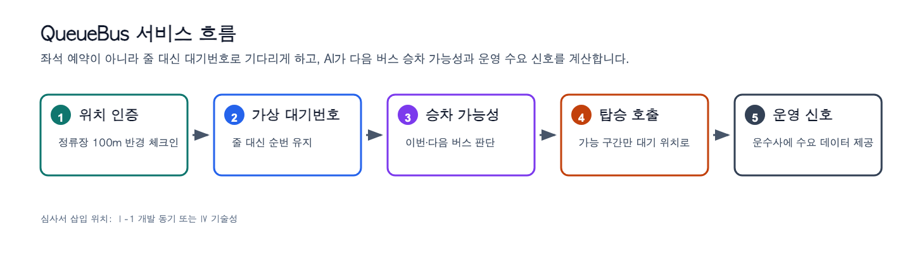

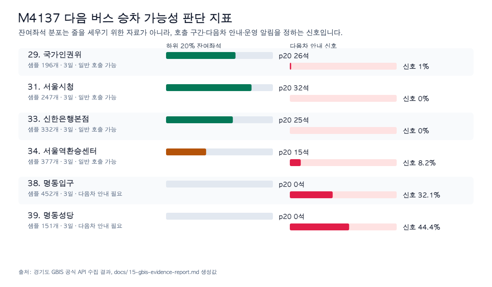

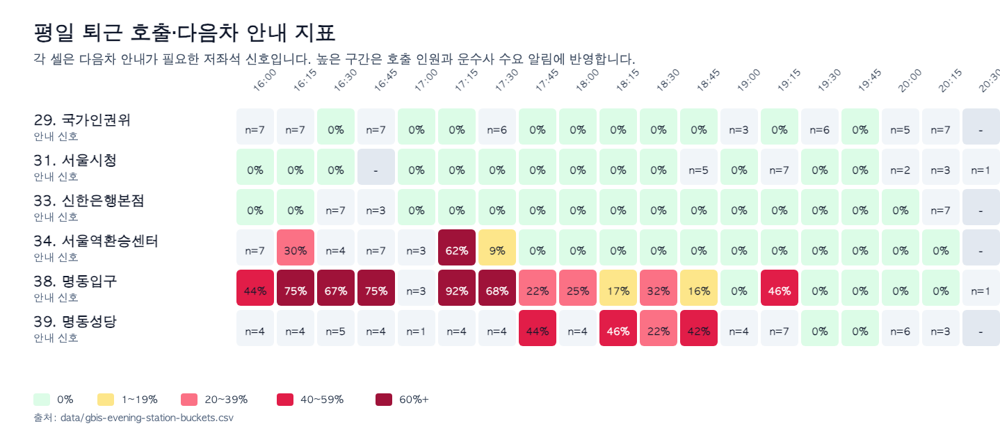


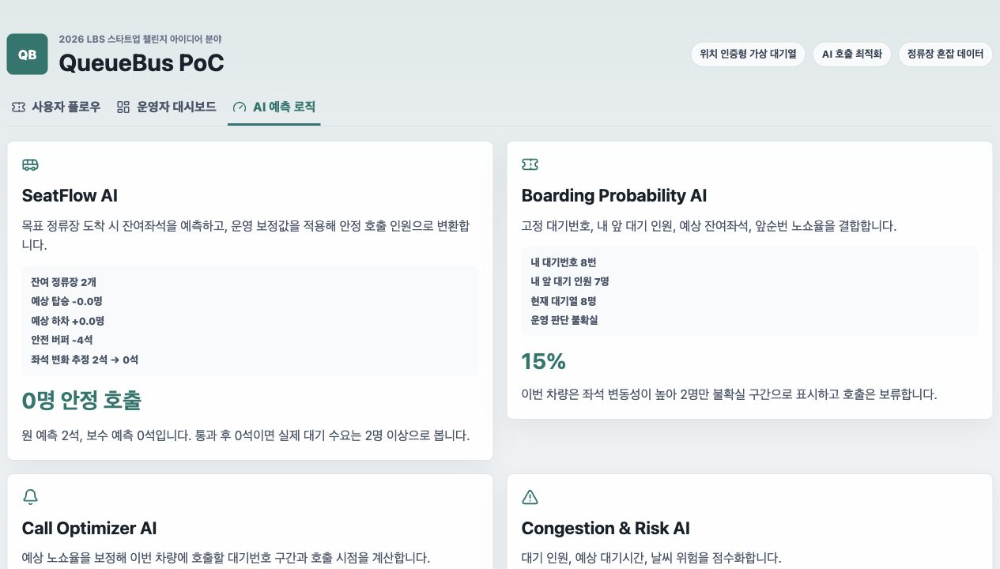

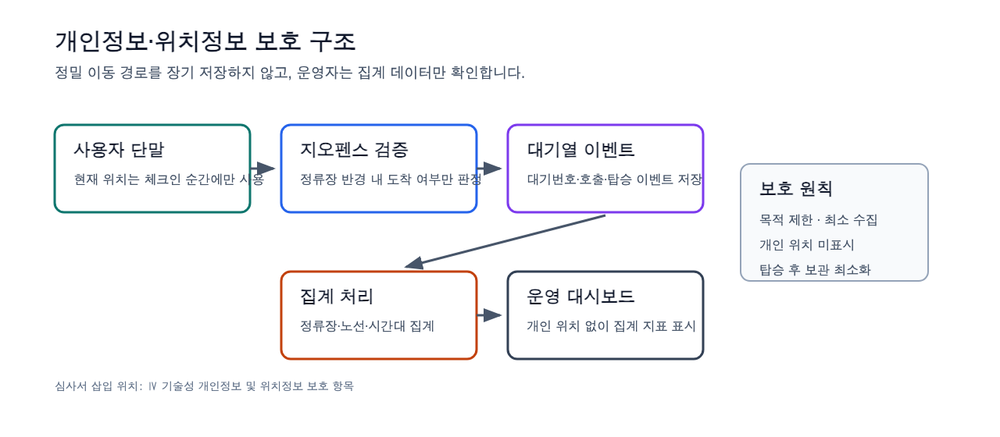

## 표 이미지 모음

아래 표 이미지는 HWP에서 표를 직접 다시 만들지 않고, 이미지로 바로 삽입할 수 있도록 `submission/hwp-assets/tables/`에 만든 파일입니다. 텍스트를 수정해야 하면 아래 본문의 원본 표를 사용하고, 그대로 제출서에 넣을 때는 PNG를 삽입합니다.

| 순서 | 삽입 위치 | 표 이미지 |
| --- | --- | --- |
| 1 | Ⅰ-2 필요성 및 창의성, 현장 실사 근거 | [01-field-observation-table.png](/Users/yun-iljun/programming/queue-bus/submission/hwp-assets/tables/01-field-observation-table.png) |
| 2 | Ⅱ-1 사업모델의 시장성 | [02-market-entry-table.png](/Users/yun-iljun/programming/queue-bus/submission/hwp-assets/tables/02-market-entry-table.png) |
| 3 | Ⅱ-2 시장 내 차별성 | [03-service-comparison-table.png](/Users/yun-iljun/programming/queue-bus/submission/hwp-assets/tables/03-service-comparison-table.png) |
| 4 | Ⅲ-1 사업 추진 목표 및 추진 계획 | [04-roadmap-table.png](/Users/yun-iljun/programming/queue-bus/submission/hwp-assets/tables/04-roadmap-table.png) |
| 5 | Ⅲ-1 성과목표 | [05-kpi-table.png](/Users/yun-iljun/programming/queue-bus/submission/hwp-assets/tables/05-kpi-table.png) |
| 6 | Ⅲ-1 사회문제 해결 및 ESG | [06-esg-table.png](/Users/yun-iljun/programming/queue-bus/submission/hwp-assets/tables/06-esg-table.png) |
| 7 | Ⅳ-1 사업모델 구현 방안 및 기술력 | [07-technology-architecture-table.png](/Users/yun-iljun/programming/queue-bus/submission/hwp-assets/tables/07-technology-architecture-table.png) |
| 8 | Ⅳ-1 AI 활용 계획 | [08-ai-modules-table.png](/Users/yun-iljun/programming/queue-bus/submission/hwp-assets/tables/08-ai-modules-table.png) |
| 9 | Ⅳ-1 개인정보 및 위치정보 보호 | [09-risk-response-table.png](/Users/yun-iljun/programming/queue-bus/submission/hwp-assets/tables/09-risk-response-table.png) |

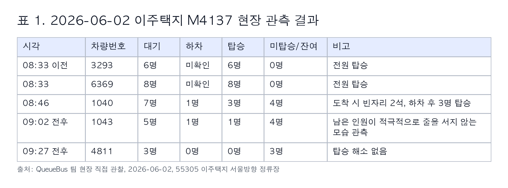

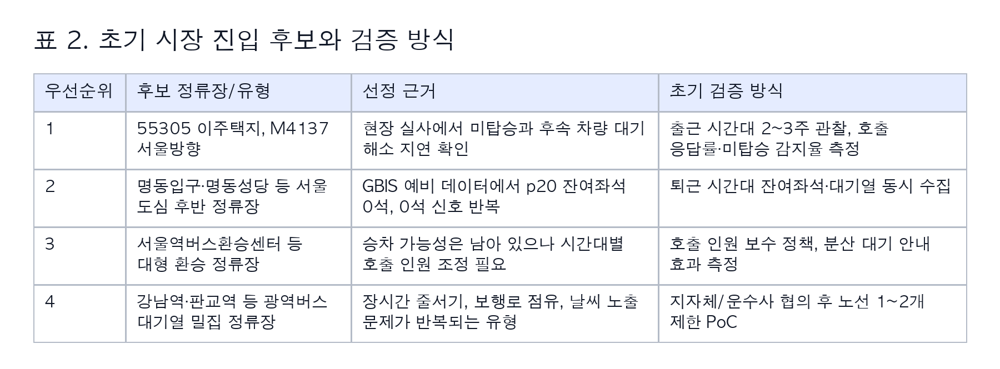

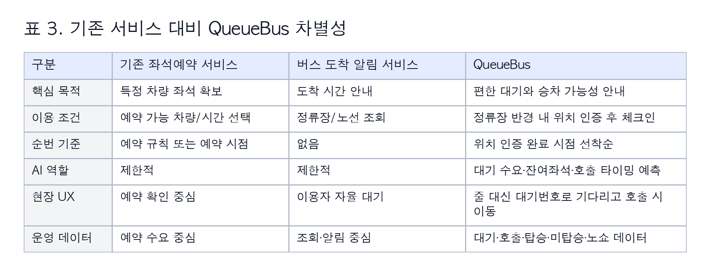

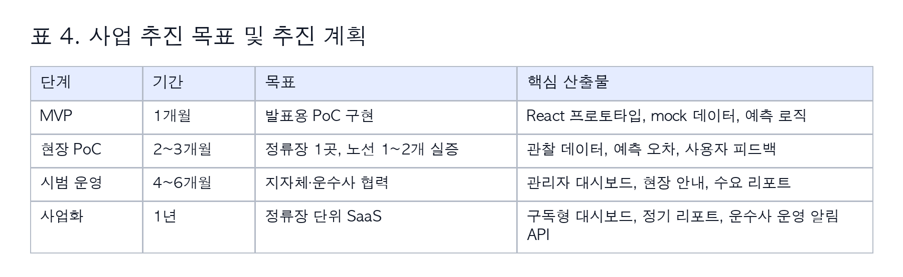

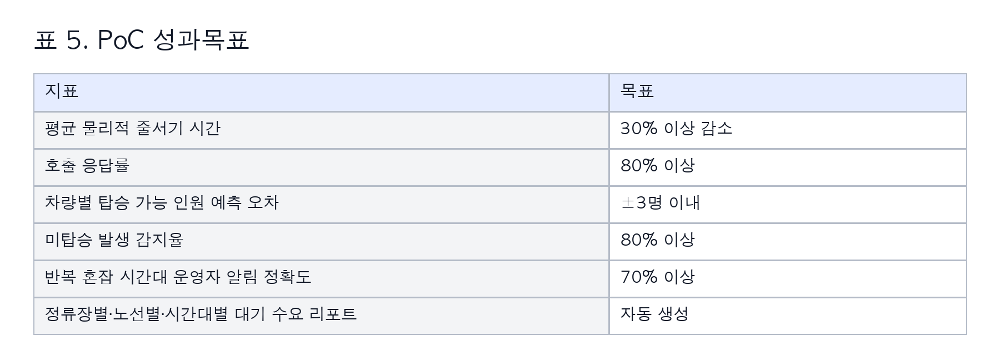

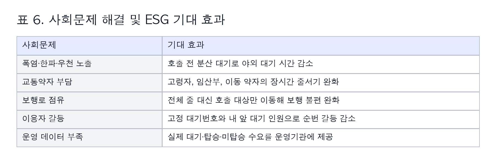

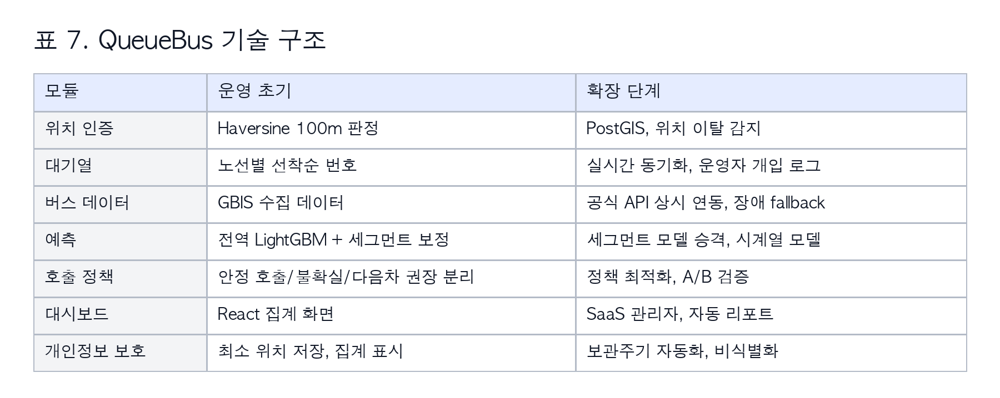

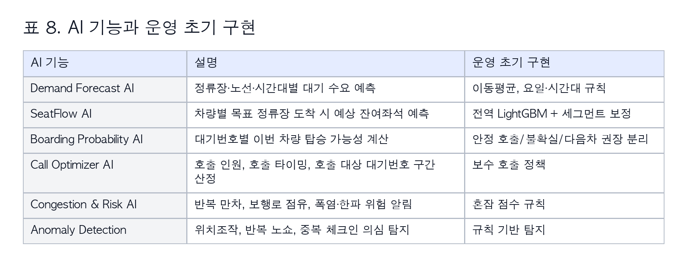

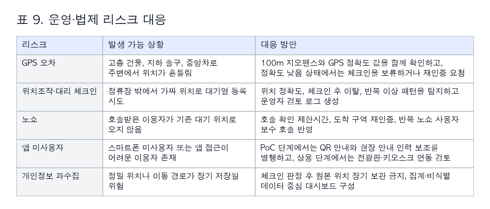

## Ⅰ. 기업가 정신

## 1. 추진역량

### 1-1. 서비스/제품 등의 아이디어에 대한 동기 및 배경

```text
QueueBus는 출퇴근 시간대 광역버스 정류장에서 반복되는 물리적 줄서기 문제를 직접 경험한 데서 출발했습니다. 동탄에서 서울로 이동할 때 4137번, 6002번, 4448번 등 여러 서울행 광역버스를 기다리며, 긴 줄을 서고도 이번 차량을 탈 수 있는지 알기 어렵고 노선별 대기 순서가 현장에서 명확히 관리되지 않는 불편을 반복적으로 체감했습니다.

폭염·한파·우천 상황에서는 야외 대기 자체가 큰 부담이 됩니다. 대기줄은 인도를 길게 점유해 보행자 이동을 방해하고, 새치기나 순번 확인 과정에서 이용자 간 갈등을 만들기도 합니다. 그러나 이용자는 이번 차를 탈 수 있는지 알기 어렵기 때문에 줄을 유지할 수밖에 없습니다.

이 문제는 개인의 불편을 넘어 정류장 운영 문제이기도 합니다. 지자체와 운수사는 정류장별·노선별·시간대별 실제 대기 인원, 승차하지 못한 인원, 대기열 길이, 승차 포기 행동을 정량적으로 파악하기 어렵습니다. 그 결과 혼잡 정류장 관리는 민원과 체감에 의존하고, 배차 조정, 예비차 투입, 현장 안내 인력 배치, 폭염·한파 안전 대응의 근거 데이터가 부족합니다.

QueueBus는 이러한 오프라인 줄서기 문제를 위치정보 기반 가상 대기열로 전환합니다. 정류장 근처에 실제 도착한 사용자만 위치 인증 후 노선별 대기열에 등록하고, 사용자는 줄에 계속 서는 대신 고정 대기번호와 내 앞 대기 인원을 보며 주변 공간에서 기다릴 수 있습니다. AI는 이번 버스와 다음 버스의 승차 가능성, 호출할 대기번호 구간, 호출 타이밍을 예측해 필요한 인원만 기존 노선 대기 위치로 호출합니다.
```

삽입 이미지:

```text
이미지: /Users/yun-iljun/programming/queue-bus/submission/hwp-assets/01-service-flow.png
캡션: QueueBus는 좌석예약이 아니라, 정류장에 실제 도착한 승객을 위치 인증으로 대기열에 등록하고 AI가 승차 가능성과 호출 구간을 예측하는 정류장 대기 관리 서비스다.
```

### 1-2. 서비스/제품의 필요성 및 창의성

```text
QueueBus는 좌석예약 서비스가 아닙니다. 특정 차량의 좌석을 미리 확보하는 방식이 아니라, 정류장 현장에 실제로 도착한 승객의 대기 순서를 위치정보로 인증하고, 줄 대신 대기번호로 편하게 기다리게 하며, AI로 다음 버스 승차 가능성과 호출 타이밍을 예측해 광역버스 정류장의 혼잡과 대기 불편을 줄이는 서비스입니다.

필요성은 다섯 가지입니다. 첫째, 이용자는 장시간 물리적 줄서기를 줄이고 호출 전에는 주변 그늘, 쉼터, 실내 공간에서 기다릴 수 있습니다. 둘째, 대기열 순번, 차량 잔여좌석, 앞순번 노쇼 가능성을 결합해 이번 버스와 다음 버스의 승차 가능성을 안내할 수 있습니다. 셋째, 폭염·한파·우천 상황에서 야외 대기 노출을 줄이고 고령자, 임산부, 교통약자의 대기 부담을 완화합니다. 넷째, 위치 인증 기반 선착순 대기번호를 고정해 새치기와 구두 순번 확인 갈등을 줄입니다. 다섯째, 정류장별·노선별·시간대별 대기 수요, 호출 응답률, 노쇼율, 미탑승 인원 데이터를 축적해 운수사와 지자체의 운영 판단 근거를 제공합니다.

창의성은 위치 인증형 현장 대기열, 다음 버스 승차 가능성 예측, 운수사 운영 수요 신호를 결합한 점입니다. 기존 버스 도착 알림은 버스가 언제 오는지를 알려주는 데 그치고, 좌석예약은 특정 차량의 좌석 확보에 초점을 둡니다. QueueBus는 정류장에 실제 도착한 승객의 대기번호를 고정 관리하고, 전체 대기자가 아니라 호출 대상 대기번호 구간만 기존 노선 대기 위치로 이동시키는 정류장 대기 관리 서비스입니다.

QueueBus의 AI는 누가 먼저 탈지 정하지 않습니다. 순번은 위치 인증 기반 선착순 대기번호로 보장하고, 앞사람 변동은 내 앞 대기 인원으로 안내합니다. AI는 대신 이번 버스가 몇 명을 태울 수 있는지, 내 순번이면 이번 버스 또는 다음 버스를 탈 가능성이 어느 정도인지, 어느 대기번호 구간을 언제 기존 노선 대기 위치로 호출해야 하는지, 운수사에 어떤 시간대 수요 신호를 보내야 하는지를 예측합니다.
```

객관 근거 표로 넣을 내용:

```text
2026년 6월 2일 55305 이주택지 서울방향 정류장에서 M4137 노선을 관찰한 결과, 08:46 차량부터 미탑승이 발생했습니다. 1040번 차량은 도착 시 빈자리 2석이었고 현장에서 1명이 하차하면서 총 3명이 탑승했지만, 대기 7명 중 4명은 탑승하지 못했습니다. 이후 1043번 차량에서도 하차 1명, 탑승 1명에 그쳐 남은 대기 4명이 해소되지 않았고, 4811번 차량은 하차 0명, 탑승 0명으로 관측되었습니다.

이 결과는 잔여좌석 정보만으로는 실제 대기 인원과 미탑승 인원을 알기 어렵다는 점을 보여줍니다. QueueBus는 위치 인증 대기열과 탑승 결과 데이터를 결합해 이용자에게는 다음 차량 승차 가능성을 안내하고, 운영기관에는 실제 미탑승 수요 신호를 제공합니다.
```

표:

| 시각 | 차량번호 | 대기 | 하차 | 탑승 | 미탑승/잔여 | 비고 |
| --- | ---: | ---: | ---: | ---: | ---: | --- |
| 08:33 이전 | 3293 | 6명 | 미확인 | 6명 | 0명 | 전원 탑승 |
| 08:33 | 6369 | 8명 | 미확인 | 8명 | 0명 | 전원 탑승 |
| 08:46 | 1040 | 7명 | 1명 | 3명 | 4명 | 도착 시 빈자리 2석, 하차 후 3명 탑승 |
| 09:02 전후 | 1043 | 5명 | 1명 | 1명 | 4명 | 남은 인원이 적극적으로 줄을 서지 않는 모습 관측 |
| 09:27 전후 | 4811 | 3명 | 0명 | 0명 | 3명 | 탑승 해소 없음 |

출처 표기:

```text
출처: QueueBus 팀 현장 직접 관찰, 2026-06-02, 55305 이주택지 서울방향 정류장
```

## Ⅱ. 추진 활동

## 2. 시장성

### 2-1. 사업모델의 시장성

```text
QueueBus의 1차 사용자는 출퇴근 광역버스 이용자입니다. 특히 혼잡 정류장에서 장시간 줄을 서는 직장인, 고령자, 임산부, 교통약자, 초행길 이용자, 폭염·한파 취약 이용자가 직접적인 수혜자입니다. 이들은 매일 반복되는 대기 불편과 탑승 가능성 불확실성을 겪기 때문에 서비스 반복 사용 가능성이 높습니다.

2차 고객은 지자체, 운수사, 교통 운영기관, 정류장 관리기관입니다. 이들은 혼잡 정류장 관리, 민원 대응, 배차 개선, 현장 질서 유지, 폭염·한파 안전 대응을 위해 실제 대기 수요 데이터가 필요합니다. QueueBus는 사용자 앱을 통해 대기열 이벤트를 수집하고, 운영자 대시보드에서 정류장별·노선별·시간대별 대기 수요와 승차 가능성 신호를 집계해 제공합니다. 운수사는 이를 통해 특정 시간대 배차 간격 조정, 예비차 투입 검토, 기사·현장 안내 인력 배치의 판단 근거를 얻을 수 있습니다.

시장 진입은 전국 단위가 아니라 혼잡 광역버스 정류장 1곳과 노선 1~2개에서 PoC를 수행하는 방식이 적절합니다. 한 정류장에서 대기시간 감소, 호출 응답률, 노쇼율, 보행로 점유 완화, 예측 정확도 같은 지표를 확보한 뒤 같은 지자체 내 주요 정류장으로 확장합니다.

사업모델은 B2C 직접 과금보다 B2G/B2B SaaS가 적합합니다. 개인 이용자는 무료 또는 지자체 서비스로 제공하고, 운영기관이 정류장 단위 SaaS 이용료, 대기 수요 리포트, 운수사 운영 알림 API, 현장 키트 설치비, API 연동 비용을 부담하는 구조입니다.
```

시장 근거 표:

| 우선순위 | 후보 정류장/유형 | 선정 근거 | 초기 검증 방식 |
| --- | --- | --- | --- |
| 1 | 55305 이주택지, M4137 서울방향 | 현장 실사에서 미탑승과 후속 차량 대기 해소 지연 확인 | 출근 시간대 2~3주 관찰, 호출 응답률·미탑승 감지율 측정 |
| 2 | 명동입구·명동성당 등 서울 도심 후반 정류장 | GBIS 예비 데이터에서 p20 잔여좌석 0석, 0석 신호 반복 | 퇴근 시간대 잔여좌석·대기열 동시 수집 |
| 3 | 서울역버스환승센터 등 대형 환승 정류장 | 승차 가능성은 남아 있으나 시간대별 호출 인원 조정 필요 | 호출 인원 보수 정책, 분산 대기 안내 효과 측정 |
| 4 | 강남역·판교역 등 광역버스 대기열 밀집 정류장 | 장시간 줄서기, 보행로 점유, 날씨 노출 문제가 반복되는 유형 | 지자체/운수사 협의 후 노선 1~2개 제한 PoC |

삽입 이미지 1:

```text
이미지: /Users/yun-iljun/programming/queue-bus/submission/hwp-assets/02-gbis-station-risk.png
캡션: 경기도 GBIS 공식 API에서 M4137 차량별 잔여좌석을 수집한 결과, 서울 도심 후반 정류장은 시간대별 승차 가능성이 크게 달라졌다. QueueBus는 이 신호를 이용해 사용자에게 이번 버스와 다음 버스의 승차 가능성을 안내한다.
출처: 경기도 GBIS 공식 API 기반 QueueBus 팀 수집·분석, 2026-05-28~2026-05-30
```

삽입 이미지 2:

```text
이미지: /Users/yun-iljun/programming/queue-bus/submission/hwp-assets/03-gbis-evening-heatmap.png
캡션: 평일 퇴근 시간대 15분 단위 분석은 특정 정류장과 시간대에서 호출 인원을 줄이거나 다음차 안내를 해야 하는 구간을 보여준다. 같은 데이터는 운수사에 피크 수요 신호로 제공될 수 있다.
출처: 경기도 GBIS 공식 API 기반 QueueBus 팀 수집·분석, 2026-05-28~2026-05-30
```

### 2-2. 시장 내 차별성

```text
QueueBus는 기존 좌석예약 서비스나 버스 도착 알림 서비스와 다릅니다. 좌석예약은 특정 차량의 좌석을 미리 확보하는 방식이고, 버스 도착 알림은 버스가 언제 오는지를 알려주는 데 그칩니다. QueueBus는 정류장에 실제 도착한 승객의 대기 순서를 위치정보로 인증하고, AI로 이번 차량 승차 가능성과 호출 구간을 예측해 줄서기 부담과 운영 데이터 부족 문제를 함께 해결합니다.

QueueBus의 차별적 우위는 세 가지입니다. 첫째, 위치정보가 부가 기능이 아니라 체크인의 필수 조건입니다. 둘째, 대기 순번은 AI가 아니라 위치 인증 완료 시점 기준 선착순으로 부여해 공정성을 보장합니다. 셋째, 이용자에게는 편한 대기를 제공하고 운영기관에는 실제 대기·탑승·미탑승·노쇼 데이터를 제공해 시민 편의와 운영 효율을 동시에 개선합니다.

특히 QueueBus는 호출 전 대기자는 주변 공간에서 기다리고, 호출 대상 대기번호 구간만 기존 노선 대기 위치로 이동하도록 설계합니다. 이는 전체 대기자가 계속 줄을 서는 방식보다 보행로 점유, 날씨 노출, 순번 갈등을 줄일 수 있습니다.
```

비교표:

| 구분 | 기존 좌석예약 서비스 | 버스 도착 알림 서비스 | QueueBus |
| --- | --- | --- | --- |
| 핵심 목적 | 특정 차량 좌석 확보 | 도착 시간 안내 | 편한 대기와 승차 가능성 안내 |
| 이용 조건 | 예약 가능 차량/시간 선택 | 정류장/노선 조회 | 정류장 반경 내 위치 인증 후 체크인 |
| 순번 기준 | 예약 규칙 또는 예약 시점 | 없음 | 위치 인증 완료 시점 선착순 |
| AI 역할 | 제한적 | 제한적 | 대기 수요·잔여좌석·호출 타이밍 예측 |
| 현장 UX | 예약 확인 중심 | 이용자 자율 대기 | 줄 대신 대기번호로 기다리고 호출 시 이동 |
| 운영 데이터 | 예약 수요 중심 | 조회·알림 중심 | 대기·호출·탑승·미탑승·노쇼 데이터 |

## 3. 성장성

### 3-1. 사업 추진 목표 및 추진 계획

```text
QueueBus의 단기 목표는 공모전 기간 내 발표 가능한 웹 기반 PoC 프로토타입과 제출용 사업계획서를 완성하는 것입니다. MVP는 실제 상용 서비스가 아니라 위치 인증, 고정 대기번호, 내 앞 대기 인원, 탑승 가능성, 호출 대상 대기번호 구간, 운영자 대시보드 흐름을 심사위원이 이해할 수 있도록 구현합니다.

중기 목표는 혼잡 광역버스 정류장 1곳에서 제한적 PoC를 수행하는 것입니다. 출퇴근 피크 시간대 현장 관찰로 실제 대기 인원, 탑승 인원, 미탑승 인원, 줄 길이, 보행로 점유 여부를 수집하고, QueueBus 예측 로직과 비교합니다.

장기 목표는 지자체·운수사 대상 정류장 단위 SaaS로 확장하는 것입니다. 대시보드와 리포트 기능을 통해 혼잡 정류장 지정, 배차 간격 조정 검토, 예비차 투입 판단, 현장 안내 인력 배치, 폭염·한파 안전 대응의 의사결정 근거를 제공합니다.
```

추진 계획 표:

| 단계 | 기간 | 목표 | 핵심 산출물 |
| --- | --- | --- | --- |
| MVP | 1개월 | 발표용 PoC 구현 | React 프로토타입, mock 데이터, 예측 로직 |
| 현장 PoC | 2~3개월 | 정류장 1곳, 노선 1~2개 실증 | 관찰 데이터, 예측 오차, 사용자 피드백 |
| 시범 운영 | 4~6개월 | 지자체·운수사 협력 | 관리자 대시보드, 현장 안내, 수요 리포트 |
| 사업화 | 1년 | 정류장 단위 SaaS | 구독형 대시보드, 정기 리포트, 운수사 운영 알림 API |

성과목표 표:

| 지표 | 목표 |
| --- | --- |
| 평균 물리적 줄서기 시간 | 30% 이상 감소 |
| 호출 응답률 | 80% 이상 |
| 차량별 탑승 가능 인원 예측 오차 | ±3명 이내 |
| 미탑승 발생 감지율 | 80% 이상 |
| 반복 혼잡 시간대 운영자 알림 정확도 | 70% 이상 |
| 정류장별·노선별·시간대별 대기 수요 리포트 | 자동 생성 |

사회문제 해결 및 ESG:

```text
QueueBus는 위치정보와 AI를 활용해 시민의 일상 이동 문제를 해결합니다. 호출 전 분산 대기를 유도해 폭염·한파·우천 노출을 줄이고, 고령자·임산부·이동 약자의 장시간 줄서기 부담을 완화합니다. 또한 전체 줄 대신 호출 대상만 이동하도록 해 보행로 점유와 이용자 간 순번 갈등을 줄이며, 운영기관에는 실제 대기·탑승·미탑승 수요 데이터를 제공합니다.
```

ESG 표:

| 사회문제 | 기대 효과 |
| --- | --- |
| 폭염·한파·우천 노출 | 호출 전 분산 대기로 야외 대기 시간 감소 |
| 교통약자 부담 | 고령자, 임산부, 이동 약자의 장시간 줄서기 완화 |
| 보행로 점유 | 전체 줄 대신 호출 대상만 이동해 보행 불편 완화 |
| 이용자 갈등 | 고정 대기번호와 내 앞 대기 인원으로 순번 갈등 감소 |
| 운영 데이터 부족 | 실제 대기·탑승·미탑승 수요를 운영기관에 제공 |

삽입 이미지:

```text
이미지: /Users/yun-iljun/programming/queue-bus/submission/hwp-assets/05-prototype-operator-dashboard.jpg
캡션: 운영자는 정류장·노선 단위로 현재 대기 인원, 안정 호출 인원, 불확실 구간, 다음차 권장 인원, 실사 미탑승 위험을 확인한다. 이는 PoC 성과지표와 운영기관 수요를 동시에 보여준다.
```

## 4. 기술성

### 4-1. 사업모델 구현 방안 및 기술력

```text
QueueBus MVP는 Vite, React, TypeScript 기반 웹 프로토타입과 GBIS 데이터 수집·분석 스크립트, SeatFlow 학습·검증 스크립트로 구성되어 있습니다. 현재 사용자 화면, AI 판단 화면, 운영자 대시보드에서 위치 인증, 대기번호, 호출 보류, 잔여좌석 예측, 안정 호출 인원, 불확실 인원, 다음차 권장 판단을 시연할 수 있습니다.

위치정보는 서비스의 부가 기능이 아니라 체크인 조건입니다. 사용자 현재 위치와 정류장 좌표를 비교해 100m 반경 내 도착 여부를 확인하고, 위치 인증이 완료된 승객에게만 노선별 대기번호를 부여합니다. 이후 위치 이탈 여부, 버스 실시간 위치, 차량 정류장 순번, 주변 대기 가능 공간 정보를 활용해 대기열 유지, 노쇼 판단, 호출 시점 계산, 분산 대기 안내를 수행합니다.

AI는 승객의 순번을 정하지 않습니다. 순번은 위치 인증 기반 선착순으로 보장하고, AI는 차량 잔여좌석, 시간대별 수요, 대기열 길이, 노쇼율, 현장 관찰 결과를 바탕으로 안정 호출 인원, 불확실 인원, 다음차 권장 인원을 분리합니다. 이를 통해 탑승 가능하다고 안내한 이용자가 실제로 못 타는 위험을 줄이는 보수 호출 정책을 적용합니다.

현재 GBIS 스냅샷과 좌석 변화 기반 탑승 추정치로 SeatFlow AI 학습 데이터셋을 만들고, Random Forest, LightGBM, XGBoost 회귀 모델을 규칙 기반 baseline과 비교했습니다. 최신 날짜 holdout 검증에서 LightGBM은 baseline 대비 MAE를 개선해 운영 초기 기본 모델 후보로 선정했습니다. 다만 상용 정확도를 단정하지 않고, PoC 단계에서 3~4주 이상 추가 데이터를 수집해 재학습·재평가할 계획입니다.
```

기술 구조 표:

| 모듈 | 운영 초기 | 확장 단계 |
| --- | --- | --- |
| 위치 인증 | Haversine 100m 판정 | PostGIS, 위치 이탈 감지 |
| 대기열 | 노선별 선착순 번호 | 실시간 동기화, 운영자 개입 로그 |
| 버스 데이터 | GBIS 수집 데이터 | 공식 API 상시 연동, 장애 fallback |
| 예측 | 전역 LightGBM + 세그먼트 보정 | 세그먼트 모델 승격, 시계열 모델 |
| 호출 정책 | 안정 호출/불확실/다음차 권장 분리 | 정책 최적화, A/B 검증 |
| 대시보드 | React 집계 화면 | SaaS 관리자, 자동 리포트 |
| 개인정보 보호 | 최소 위치 저장, 집계 표시 | 보관주기 자동화, 비식별화 |

AI 기능 표:

| AI 기능 | 설명 | 운영 초기 구현 |
| --- | --- | --- |
| Demand Forecast AI | 정류장·노선·시간대별 대기 수요 예측 | 이동평균, 요일·시간대 규칙 |
| SeatFlow AI | 차량별 목표 정류장 도착 시 예상 잔여좌석 예측 | 전역 LightGBM + 세그먼트 보정 |
| Boarding Probability AI | 대기번호별 이번 차량 탑승 가능성 계산 | 안정 호출/불확실/다음차 권장 분리 |
| Call Optimizer AI | 호출 인원, 호출 타이밍, 호출 대상 대기번호 구간 산정 | 보수 호출 정책 |
| Congestion & Risk AI | 반복 만차, 보행로 점유, 폭염·한파 위험 알림 | 혼잡 점수 규칙 |
| Anomaly Detection | 위치조작, 반복 노쇼, 중복 체크인 의심 탐지 | 규칙 기반 탐지 |

삽입 이미지 1:

```text
이미지: /Users/yun-iljun/programming/queue-bus/submission/hwp-assets/04-prototype-passenger-checkin.jpg
캡션: 위치 인증 후 노선별 고정 대기번호를 발급하고, 잔여좌석 위험이 높을 때는 무리하게 호출하지 않고 호출 보류와 다음차 안내를 제공한다.
```

삽입 이미지 2:

```text
이미지: /Users/yun-iljun/programming/queue-bus/submission/hwp-assets/06-prototype-ai-prediction.jpg
캡션: SeatFlow AI는 잔여좌석 예측값을 그대로 호출 인원으로 쓰지 않고 안전 버퍼와 보수 보정을 적용해 안정 호출·불확실·다음차 권장을 분리한다.
```

### 개인정보 및 위치정보 보호

```text
QueueBus는 위치정보를 정류장 체크인, 대기열 유지, 호출 안내 목적에 한정해 사용합니다. 개인의 정밀 이동 경로를 장기 저장하지 않고, 운영자 대시보드에는 개인 단위 위치가 아니라 정류장·노선·시간대 단위 집계 데이터만 표시합니다. 탑승 완료 후 개인 식별 가능한 위치정보는 최소 보관하고, 통계 목적 데이터는 비식별화합니다.

GPS 오차, 위치조작, 노쇼, 앱 미사용자, 호출 직전 재혼잡 위험에 대해서는 체크인 재인증, 위치 정확도 확인, 호출 제한시간, 현장 안내 인력 보조, 보수 호출 정책으로 대응합니다. 위치정보사업 또는 위치기반서비스 신고·등록 필요 여부는 사업화 단계에서 법률 자문과 함께 검토합니다.
```

리스크 대응 표:

| 리스크 | 발생 가능 상황 | 대응 방안 |
| --- | --- | --- |
| GPS 오차 | 고층 건물, 지하 출구, 중앙차로 주변에서 위치가 흔들림 | 100m 지오펜스와 GPS 정확도 값을 함께 확인하고, 정확도 낮음 상태에서는 체크인을 보류하거나 재인증 요청 |
| 위치조작·대리 체크인 | 정류장 밖에서 가짜 위치로 대기열 등록 시도 | 위치 정확도, 체크인 후 이탈, 반복 이상 패턴을 탐지하고 운영자 검토 로그 생성 |
| 노쇼 | 호출받은 이용자가 기존 대기 위치로 오지 않음 | 호출 확인 제한시간, 도착 구역 재인증, 반복 노쇼 사용자 보수 호출 반영 |
| 앱 미사용자 | 스마트폰 미사용자 또는 앱 접근이 어려운 이용자 존재 | PoC 단계에서는 QR 안내와 현장 안내 인력 보조를 병행하고, 상용 단계에서는 전광판·키오스크 연동 검토 |
| 개인정보 과수집 | 정밀 위치나 이동 경로가 장기 저장될 위험 | 체크인 판정 후 원본 위치 장기 보관 금지, 집계·비식별 데이터 중심 대시보드 구성 |

삽입 이미지:

```text
이미지: /Users/yun-iljun/programming/queue-bus/submission/hwp-assets/07-privacy-data-flow.png
캡션: 운영자 대시보드는 개인의 실시간 위치나 이동 경로를 표시하지 않고, 정류장·노선·시간대 단위 집계 지표만 제공한다.
```

## 마지막 강조 문장

```text
QueueBus는 광역버스 좌석을 예약하는 서비스가 아니라, 정류장에 실제 도착한 승객의 대기 순서를 위치정보로 인증하고, AI가 차량별 승차 가능성과 호출 시점을 예측해 물리적 줄서기 부담을 줄이는 정류장 대기 관리 서비스입니다. GBIS 공식 API 데이터는 승차 가능성 변동을 보여주고, 55305 이주택지 현장 실사는 실제 미탑승과 대기 해소 지연이 발생함을 확인했습니다. QueueBus는 이 두 데이터를 결합해 이용자에게는 이번 차를 탈 수 있는지를 안내하고, 운영기관에는 어느 정류장·시간대에 실제 수요가 해소되지 않는지를 제공하는 LBS 기반 공공 교통 서비스입니다.
```

## 참고·출처 표기

HWP 하단 또는 각 표/이미지 아래에 짧게 넣을 출처입니다.

```text
출처: 2026 LBS 스타트업 챌린지 공식 모집요강, https://www.korealbs.or.kr/2026/contest.asp
출처: 경기도 GBIS 공식 API 기반 QueueBus 팀 수집·분석, 2026-05-28~2026-05-30
출처: QueueBus 팀 현장 직접 관찰, 2026-06-02, 55305 이주택지 서울방향 정류장
출처: QueueBus React 프로토타입 화면 캡처, 2026-06
```
